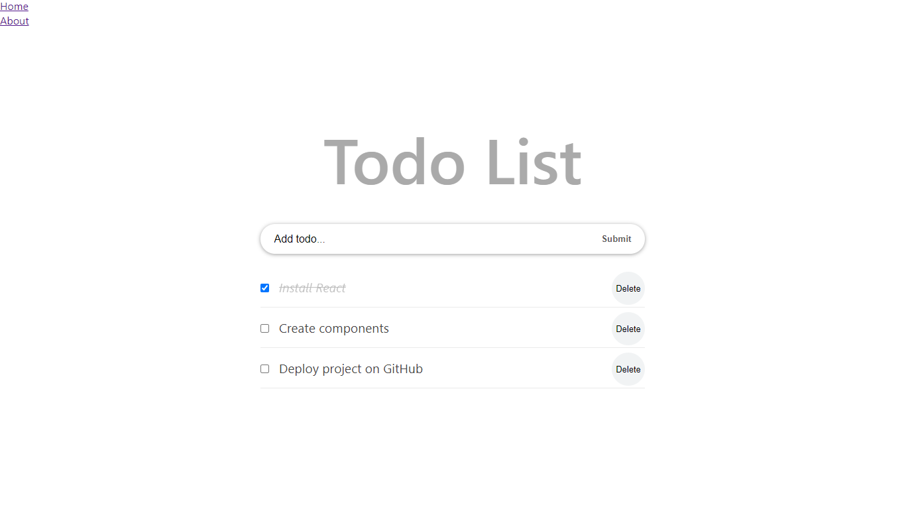

# Todo list 

> This is a project that displays a list of things that one wants to get done or that need to get done.
# Screenshot

# Built With

- ReactJS
## Live Demo

[Live Demo Link](https://toliboff.github.io/reactive-todo-list/)

# Getting started

## To get a local copy of this repository kindly follow the steps below.
- In your local PC, open your terminal or command prompt in the folder you would like to clone this repository into
- Make sure you have `Node NPM` installed on your computer
- Clone or download this repo on your machine: `git clone https://github.com/reactive-todo-list.git`
- Enter project directory with command `cd reactive-todo-list`
### Install
- Run `npm install`
- Run `run build`
### Testing
- Run `npm test`
### Usage
- Run `npm start`
- Open `index.html` in your browser
# Author
:bust_in_silhouette: Tolibjon Tolibov
- GitHub: [@toliboff](https://https://github.com/toliboff)
- Twitter: [@tolib_tolibov](https://twitter.com/tolib_tolibov)
- LinkedIn: [Tolibjon](https://linkedin.com/in/tolibjon-tolibov)

# Contributing
Contributions, issues, and feature requests are welcome!

Feel free to check the [issues page.](https://github.com/toliboff/reactive-todo-list/issues)

# Show your support
Give a :star: if you like this project!

* [ReactJS](https://reactjs.org/)
* [GitHub](https://www.github.com)
* [FontAwesome Icons](https://fontawesome.com)
* [Google Fonts](https://fonts.google.com)
* [Microverse](https://microverse.org)

